# My 15-days Training Journey
--- 
## Day-1
- To begin with, we all gathered in the college auditorium at 8:30 sharp with great enthusiasm, where our department faculty members explained the following
  - norms and regulations
  - syllabus
  - societis
  - projects, etc
    

- Furthermore, around 9:30 we headed towards our respective labs, where faculty members taugth us for four hours with following outcomes:
    - Here, we learned about product based, service based companies and startups.
    - Our teacher started the basics of linux OS in order the built our basic foundation in this field.
    - We explored the features of linux which make it is one of the best OS
        - Open source
        - Ease of use
        - Highly secure
        - Customization
        - Licensing
        - Software Compatibility, etc
    - To add more, our teacher shared her own expering of working in a company and provide various crucial tips
    - Furthermore, she interacted with us and and enquired our future aspirations and goals
    - To proceed with, we downloaded Virtual Box, Ubuntu and Microsoft Visual C++
    - Finally, once the linux setup completed, we concluded our 4-hours session with certain words of wisdom form our Mentor
- In a nutshell, our first day at training was quite productive and inspirative
----
## Day-2

### Fundamentals of Linux/Unix and Bash

-	**Booting of computer and its types**
    1.	Cold boot   
        - Starting a computer from power off state
    3.	Warm boot  
        - Restarting the computer without off power

- **Kernel (a computer program)**
    1.	Like a chef , can’t see, but working with hardware
    2.	Waiter is shell
    3.	Complete control over everything in the system
    4.	Core of  computer operating system
      	- File management
        - i/o management
        - memory management, etc

  ```mermaid
  graph LR
    USER["User"]
    SHELL["Shell (Command Interpreter)"]
    KERNEL["Kernel (Core OS)"]
    HARDWARE["Hardware"]
  
    USER --> SHELL
    SHELL --> KERNEL
    KERNEL --> HARDWARE


-	**Shell (Waiter) & Bash**
    -	A program – interface between the user and OS
    -	Gives instructions to computer – opening files, etc
    -	Commands -> computer language
    -	Types of shell
        -	Bash – most common
        -	Sh – original 
        -	ksh
        -	csh
    -	Categories
        -	Command line 
        -	Graphics User

  - **File Structure**
     
      |Directory   |Function        |
      |---|---|
      | `/` | Root of the filesystem |
      | `/home` | User folders |
      | `/lib`  | System libraries |
      | `/bin`  | Basic commands |
      | `/boot` | Boot files |
      | `/dev` | Device files |
      | `/media` | Auto-mounted drives |
      | `/mnt` | Manual mounts |
      | `/opt` | Optional apps |
      | `/sbin` | Admin commands |
      | `/var` | Logs & data |
      | `/tmp` | Temporary files |

    **File Structure (Flowchart)**

    ```mermaid
    graph TD
    ROOT["/ (Root)"]
    ROOT --> HOME["home"]
    ROOT --> LIB["lib"]
    ROOT --> BIN["bin"]
    ROOT --> BOOT["boot"]
    ROOT --> DEV["dev"]
    ROOT --> MEDIA["media"]
    ROOT --> MNT["mnt"]
    ROOT --> OPT["opt"]
    ROOT --> SBIN["sbin"]
    ROOT --> VAR["var"]
    ROOT --> TMP["tmp"]
         

- **Commands**
    - **`ls`** – Lists contents of the current folder.

      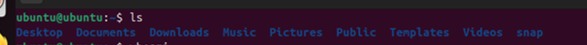

      
    - **Don’t access `/` directly** – Root directory; changing things here can break the system.  
    - **`mkdir`** – Creates a new directory.
      
      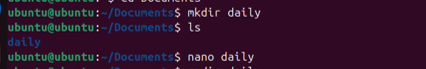

      
    - **`cat`** – Creates or displays file content.  
    - **`touch`** – Creates an empty file.
      
      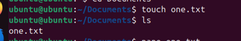

        
    - **`whoami`** – Shows your current username.
      
      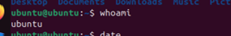

      
    - **`date`** – Displays the current date and time.
      
      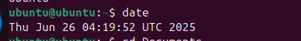

      
    - **`cd`** – Changes the current directory.
      
      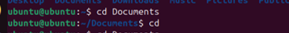

      
    - **`cd -`** – Switches to the previous directory.
      
      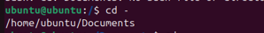

      
    - **`cp`** – Copies files or folders.
      
      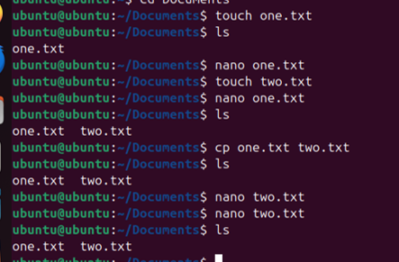

      
    - **`pwd`** – Prints the current directory path.
      
      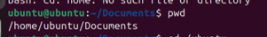

        
    - **`whereis`** – Finds the location of command’s binary, source, and manual.
      
      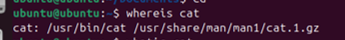

      
    - **`whatis`** – Shows a short description of a command.
      
      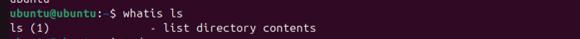

      
    - **`mv`** – Moves or renames files and directories.
      
      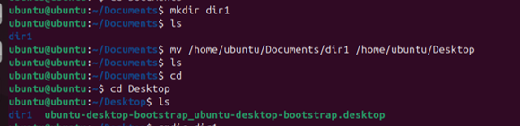

      
    - **`rmdir`** – Removes an empty directory.
      
      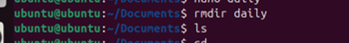

      
    - **`Ctrl + Alt + T`** – Opens the terminal directly.
      


    


    
