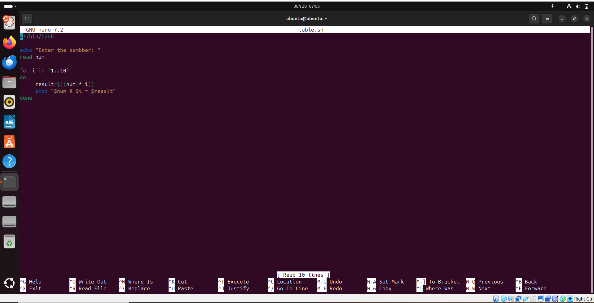

# My 15-days Training Journey
--- 
## Day-1
- To begin with, we all gathered in the college auditorium at 8:30 sharp with great enthusiasm, where our department faculty members explained the following
  - norms and regulations
  - syllabus
  - societis
  - projects, etc
    

- Furthermore, around 9:30 we headed towards our respective labs, where faculty members taugth us for four hours with following outcomes:
    - Here, we learned about product based, service based companies and startups.
    - Our teacher started the basics of linux OS in order the built our basic foundation in this field.
    - We explored the features of linux which make it is one of the best OS
        - Open source
        - Ease of use
        - Highly secure
        - Customization
        - Licensing
        - Software Compatibility, etc
    - To add more, our teacher shared her own expering of working in a company and provide various crucial tips
    - Furthermore, she interacted with us and and enquired our future aspirations and goals
    - To proceed with, we downloaded Virtual Box, Ubuntu and Microsoft Visual C++
    - Finally, once the linux setup completed, we concluded our 4-hours session with certain words of wisdom form our Mentor
- In a nutshell, our first day at training was quite productive and inspirative
----
## Day-2

### Fundamentals of Linux/Unix and Bash

-	**Booting of computer and its types**
    1.	Cold boot   
        - Starting a computer from power off state
    3.	Warm boot  
        - Restarting the computer without off power

- **Kernel (a computer program)**
    1.	Like a chef , can’t see, but working with hardware
    2.	Waiter is shell
    3.	Complete control over everything in the system
    4.	Core of  computer operating system
      	- File management
        - i/o management
        - memory management, etc

  ```mermaid
  graph LR
    USER["User"]
    SHELL["Shell (Command Interpreter)"]
    KERNEL["Kernel (Core OS)"]
    HARDWARE["Hardware"]
  
    USER --> SHELL
    SHELL --> KERNEL
    KERNEL --> HARDWARE


-	**Shell (Waiter) & Bash**
    -	A program – interface between the user and OS
    -	Gives instructions to computer – opening files, etc
    -	Commands -> computer language
    -	Types of shell
        -	Bash – most common
        -	Sh – original 
        -	ksh
        -	csh
    -	Categories
        -	Command line 
        -	Graphics User

  - **File Structure**
     
      |Directory   |Function        |
      |---|---|
      | `/` | Root of the filesystem |
      | `/home` | User folders |
      | `/lib`  | System libraries |
      | `/bin`  | Basic commands |
      | `/boot` | Boot files |
      | `/dev` | Device files |
      | `/media` | Auto-mounted drives |
      | `/mnt` | Manual mounts |
      | `/opt` | Optional apps |
      | `/sbin` | Admin commands |
      | `/var` | Logs & data |
      | `/tmp` | Temporary files |

    **File Structure (Flowchart)**

    ```mermaid
    graph TD
    ROOT["/ (Root)"]
    ROOT --> HOME["home"]
    ROOT --> LIB["lib"]
    ROOT --> BIN["bin"]
    ROOT --> BOOT["boot"]
    ROOT --> DEV["dev"]
    ROOT --> MEDIA["media"]
    ROOT --> MNT["mnt"]
    ROOT --> OPT["opt"]
    ROOT --> SBIN["sbin"]
    ROOT --> VAR["var"]
    ROOT --> TMP["tmp"]
         

- **Commands**
    - **`ls`** – Lists contents of the current folder.

      

      
    - **Don’t access `/` directly** – Root directory; changing things here can break the system.  
    - **`mkdir`** – Creates a new directory.
      
      

      
    - **`cat`** – Creates or displays file content.  
    - **`touch`** – Creates an empty file.
      
      

        
    - **`whoami`** – Shows your current username.
      
      

      
    - **`date`** – Displays the current date and time.
      
      

      
    - **`cd`** – Changes the current directory.
      
      

      
    - **`cd -`** – Switches to the previous directory.
      
      

      
    - **`cp`** – Copies files or folders.
      
      

      
    - **`pwd`** – Prints the current directory path.
      
      

        
    - **`whereis`** – Finds the location of command’s binary, source, and manual.
      
      

      
    - **`whatis`** – Shows a short description of a command.
      
      

      
    - **`mv`** – Moves or renames files and directories.
      
      

      
    - **`rmdir`** – Removes an empty directory.
      
      

      
    - **`Ctrl + Alt + T`** – Opens the terminal directly.
  ---
  ## Day 3
  - **Bare Metal Installation**
    1. Installation directly using USB
    2. Direct installation in computer hardware
    3. No OS in between
    4. Example – you delete windows-> install Ubuntu using USB ->no windows, no 
       mac only linux as main OS

  - **Partitioning schemes**
    1. Dividing a hard disk into separate sections.
    2. Each section (partition) acts like an independent disk.
    3. Helps organize data and install multiple OS.
    4. Types:
        - MBR (Master Boot Record)
            - Max 4 primary partitions.
            - Supports up to 2 TB.
            - Older, used with BIOS.
            - less flexible
        - GPT (GUID Partition Table)
            - Supports 128+ partitions.
            - Works with disks >2 TB.
            - Newer, used with UEFI.
            - more flexible
  - **File and Directory permissions**
       - Types of Users  
    ```mermaid
    graph TD
        A[Users] --> B[Owner]  
        A --> C[Group]  
        A --> D[Others]
    
    ```


       - Types of permissions
      ```mermaid
            graph TD
            P[Permissions] --> R[Read \`r\']
            P --> W[Write \`w\`]
            P --> X[Execute \'x\`]
      ```

       - Types of Commands
           - `chmod`
               - Changes file permissions (read, write, execute).  
                    1. chmod 755 file.txt  
                       Sets permissions:  
                       7 = Owner → read, write, execute  
                       5 = Group → read, execute  
                       5 = Others → read, execute  
                       Used to make a file executable and readable by everyone

                  
             
                    3. chmod 444 – read only permission to everyone  
                    4. chmod 644 – permissions to owner only  
                    5. chmod +x filename  
                           +x – execute the file  
                           ./filename  
                           ./ - To run a file  

 
  

          - `chown`  
               - Changes file owner or group.      
                 1. chown user:group file.txt  
                    Change the owner to user       
                    Change the group to group      
                    So that other users in that group can access the file
                    Example:
                    - original owner = ubuntu(user)
                      
   
                    - ubuntu change to karman
                       
                  
                    - new owner = karman
                      
      

  - **Redirection**
       - lets you change where input comes from or where output goes.
          
       - Output Redirection (> and >>)  
                -	`>` : Sends output to a file (overwrites if file exists)  
                Example: echo "Hi" > file.txt  
                -	`>>` : Appends output to the file (doesn't overwrite)  
                Example: echo "Bye" >> file.txt  
                -	`echo`: can create a file when used with output redirection  
 
         
  
       - Input Redirection (<) 
                -	`<` : Takes input from a file instead of the keyboard  
                Example: cat < file.txt  

  - **Pipes**
      
      - Pipes (|) are used to pass the output of one command as the input to another.   
      
      ✅ Example:      
        -`ls | sort`   
            -	Lists files and sorts them.  
     
    
      
      ✅ Example:    
        -`cat file.txt | grep “hello”`     
            - cat file.txt shows the file   
            -	grep "hello" filters lines containing "hello"


    - **Assignement**
      1. To use the variables  

         
         
    
      3. To compare  
 
           
      
      4. To print the table
         
         
         
---
    
## Day-4
- **File compression**  

  - File Compression:  
    File compression reduces file size to save space or speed up transfer.  

    🔁 Lossless Compression:
      - No data is lost.
      - Original file can be fully restored.
        
    ✅ Example: `zip`, `gzip`, `PNG`, `FLAC`
    
    🗑️ Lossy Compression:
      - Some data is permanently removed.
      - Smaller size but lower quality.
      
    ✅ Example: `JPEG`, `MP3`, `MP4`

    🗜️ `gzip`:
       - A lossless compression tool in Linux.
       - Compresses individual files (not folders).
       - `gzip filename.txt`  
         -> creates a file `filename.txt.gz`  
         -> `filename.txt` is deleted
         -> use `gzip -k filename.txt` to keep the original file
          
          
  
     - Uncompress the files – `gunzip filename.gz`

  - **Wild Cards**  
     Wildcards are special characters used to match filenames or patterns    
     when working in the terminal (like with ls, cp, rm, etc.).  
 
        

      | Wildcard | Meaning                                      | Example                            |
      |----------|----------------------------------------------|------------------------------------|
      | `*`      | Matches **zero or more** characters          | `ls *.txt` → all `.txt` files      |
      | `?`      | Matches **exactly one** character             | `ls file?.txt` → file1.txt, file2.txt |
      | `[]`     | Matches **any one** character in brackets     | `ls file[1-3].txt` → file1.txt, file2.txt, file3.txt |
    


  - **Hardware**  
      ### 🖥️ A. Basic Computer Architecture

      | Term                  | Definition                                             |
      |-----------------------|--------------------------------------------------------|
      | **PC (Hardware)**     | Physical components of a computer.                     |
      | **System Software**   | OS installed on hardware (e.g., Windows, Ubuntu).      |
      | **Application Software** | Installed on OS (e.g., MS Word, Chrome, VLC).       |
      
      ---
      
      ### 🧠 B. CPU & Internal Components
      
      | Component             | Definition                                             |
      |-----------------------|--------------------------------------------------------|
      | **CPU**               | Central Processing Unit; brain of the computer.        |
      | **Motherboard**       | Main circuit board connecting all components.          |
      | **RAM**               | Volatile memory; data lost on shutdown.                |
      | **ROM**               | Non-volatile memory; stores firmware.                  |
      | **Cache**             | Very fast memory between CPU and RAM.                  |
      | **Registers**         | Small, fast memory inside CPU for temporary data.      |
      | **Control Unit (CU)** | Directs data flow and operations in CPU.               |
      | **ALU**               | Performs calculations and logic.                       |
      | **Clock**             | Synchronizes CPU operations using electrical pulses.   |
      | **Transistors**       | Basic switching units used in processing.              |
      | **Chipset**           | Controls communication; Northbridge and Southbridge.   |
      | **CPU Socket**        | Slot where CPU is mounted; fan usually above it.       |

     **Motherboard**   
         
      
      ---
      
      ### 💾 C. Storage Devices
      
      | Component             | Definition                                             |
      |-----------------------|--------------------------------------------------------|
      | **Hard Disk (HDD/SSD)** | Permanent storage for OS, apps, and files.           |
      | **RAM**               | Temporary, fast memory used during system operation.   |
      | **Cache**             | Small, faster memory for urgent data access.           |
      | **Floppy Disk**       | Old magnetic storage medium (now obsolete).            |
      | **CD/DVD**            | Optical media used to read/write data.                 |
      | **BD (Blu-ray Disk)** | High-capacity optical disk for HD media and backups.   |
      
      ---
      
      ### ⚡ D. Power & Booting
      
      | Component             | Definition                                             |
      |-----------------------|--------------------------------------------------------|
      | **Power Supply (SMPS)** | Converts AC to DC; supplies power to components.     |
      | **UPS**               | Battery backup for power outages.                      |
      | **CMOS Battery**      | Maintains BIOS settings and system time.               |
      | **Boot Process**      | Power on → ROM → Bootstrap Loader → OS loads in RAM.   |
      
      ---
      
      ### 🖼️ E. Input/Output & Display
      
      | Component             | Definition                                             |
      |-----------------------|--------------------------------------------------------|
      | **Monitor**           | Output device to display visuals.                      |
      | **HDMI Port**         | High-definition video output for projectors/displays.  |
      | **VGA Port**          | Older analog video output; needs converter for HDMI.   |
      | **Display Adapter**   | Processes and displays graphics (GPU).                 |
      | **TV Tuner Adapter**  | Enables TV signal input to PC.                         |
      
      ---
      
      ### 🌐 F. Networking & Communication
      
      | Component             | Definition                                             |
      |-----------------------|--------------------------------------------------------|
      | **LAN (Local Area Network)** | Network connecting nearby computers.            |
      | **Modem**             | Converts digital ↔ analog signals for internet.        |
      | **LAN Card / NIC**    | Allows PC to connect to network via cable.             |
      
      ---
      
      ### 🧩 G. Other Components & Concepts
      
      | Component             | Definition                                             |
      |-----------------------|--------------------------------------------------------|
      | **Drivers**           | Software that lets OS interact with hardware.          |
      | **BIOS Chip**         | Firmware chip that starts hardware and loads OS.       |
      | **Peripheral Devices**| External devices like mouse, keyboard, printer, etc.   |
      | **PCI Slots**         | Expansion slots for adding cards (e.g., sound, LAN).   |
      | **Expansion Slots**   | Slots for adding extra hardware (graphics, TV cards).  |
      | **SATA Ports**        | Connect HDDs and SSDs to motherboard.                  |
      | **Beep Sound**        | POST error codes (e.g., via speaker/copper coil).      |
      | **Cooling System**    | Fans or heat sinks to prevent overheating.             |
      | **Configuration**     | System specs: RAM, CPU speed, storage, brand, etc.     |
---
## Day-5
- # 📘 Module 2: PC & Network Troubleshooting

---

## 🧩 1. PC Hardware Troubleshooting

### 🔹 Boot Issues
- No display, beep codes during startup
- Use **F1** or **Windows + F1** for system help
- Fewer folders on desktop (stored in C-drive)

### 🔹 Diagnosing Hardware Failures
- Components to check: **RAM**, **HDD**, **GPU**, **CPU**, **cache**, **resistors**
- **RAM vs ROM**:
  - **RAM**: Temporary, fast, volatile
  - **ROM**: Permanent, stores firmware
- **Cache**: Small, fast memory inside CPU for frequently used data

### 🔹 HDD and Partitions
- **HDD Types**: SATA, SSD, NVMe
- **Partitioning**:
  - **Logical Partition**: Divides storage for software/data
  - **Extended Partition**: Contains multiple logical drives
- **Drive Usage**:
  - **C-drive**: Only OS
  - **D/E drives**: Store personal/important files
  - If C crashes, other drives are safe
- **Defragmentation**:
  - Fragmentation slows system
  - Defragmentation reorganizes data to improve performance

### 🔹 BIOS/UEFI & POST
- Configure BIOS settings
- Troubleshoot POST error codes and boot issues

### 🔹 Peripheral Devices & Printing
- Devices: Keyboard, mouse, printer
- **Printer Troubleshooting**:
  - Driver missing → install driver
  - Paper stuck → remove manually
  - Tray empty → reload paper
  - Red light → restart printer
  - Use print preferences to:
    - Cancel print jobs
    - Set priority
  - Lines in print → **Drum problem** → replace drum

### 🔹 System Performance Tips
- Fewer desktop icons and taskbar items = faster boot
- Avoid saving heavy files on C-drive
- Use extended partitions for important data

---

## 💻 2. Software/System Troubleshooting

### 🔹 Recovery & Repair
- Use **Safe Mode**, **System Restore**, and recovery tools
- Use GUI-based (wizard) OS installations
- Format only **C-drive** during OS reinstall to keep personal files safe

### 🔹 Antivirus & Malware
- Mandatory if using the internet
- Keep antivirus updated
- Schedule regular antivirus scans
- Malware symptoms:
  - Slows down the system
  - Corrupts files
  - Creates unnecessary temp files
- Avoid clicking on unknown or suspicious links

### 🔹 Temporary Files & Cookies
- Browsers create temp files and cookies → system slows
- Clear cookies/cache regularly
- Keep browser bookmarks minimal

### 🔹 Drivers & Disk Tools
- Use **Device Manager** to update/fix drivers
- Use disk utilities:
  - `chkdsk` for disk error checking
  - Formatting tools to reset drives
  - Defragmentation tools to optimize storage

---

## 🆘 3. Help, Updates & Windows Versions

### 🔹 Help Access
- `F1`: App-specific help
- `Windows + F1`: Opens **Get Help** app in Windows

### 🔹 Windows: Original vs Pirated

| Feature                     | Original Windows                          | Pirated Windows             |
|----------------------------|--------------------------------------------|-----------------------------|
| Updates                    | Automatic security and feature updates     | No official updates         |
| Delivery Optimization      | Speeds up download of updates              | Not available               |
| Security Patches           | Regular and automatic                      | Missing                     |
| Performance After Update   | May slow down → schedule updates           | No slowdowns, but insecure  |

---


      


 
  
      


       


      


    


    
