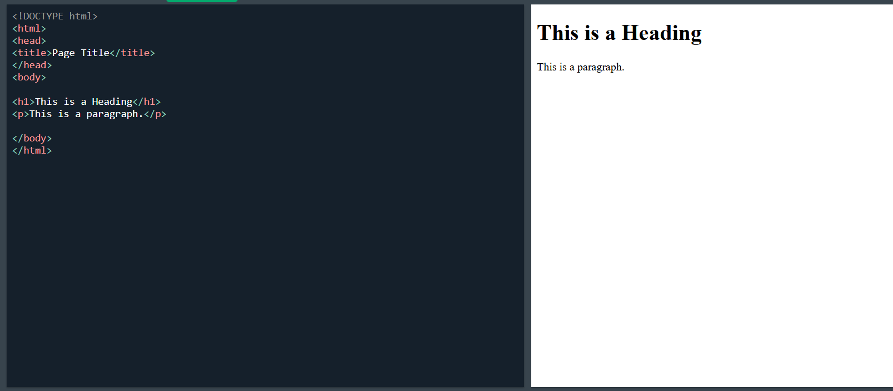

# 🌐 Module 3: Introduction to HTML & Web Basics

---

## ✅ What is HTML?
- HTML = **HyperText Markup Language**
- Used to **structure content** on web pages
- Not a programming language, just a **markup language**
- Uses **tags** (like `
`, `<h1>`, ``) to define elements

---

## 🖥️ How Browsers Render HTML
- Browser **reads HTML line-by-line**
- Converts it into a **DOM (Document Object Model)**
- Renders the page visually using:
  - **HTML** for structure  
  - **CSS** for styling  
  - **JavaScript** for interactivity

---

## 📄 Structure of an HTML Document

### 1. `<!DOCTYPE html>`
- Declares HTML5 version
- Helps browser interpret the page correctly

### 2. `<html>`
- Root tag of the document
- Wraps all other elements

### 3. `<head>`
- Contains **metadata** (not shown on page)
- Includes:
  - `<title>` – Page title
  - `<meta>` – Info like character set
  - `<link>` – External CSS
  - `<script>` – Optional scripts

### 4. `<body>`
- Contains **visible content**
- Includes:
  - Text (`<h1>`, `
`)
  - Images (``)
  - Links (`<a>`)
  - Lists, tables, forms, etc.

---

## 🧩 Summary Table

| Part         | Description                           |
|--------------|---------------------------------------|
| `<!DOCTYPE>` | Declares HTML version (HTML5)         |
| `<html>`     | Wraps the entire page content         |
| `<head>`     | Contains meta info (title, links)     |
| `<body>`     | Displays all visible elements         |

---

